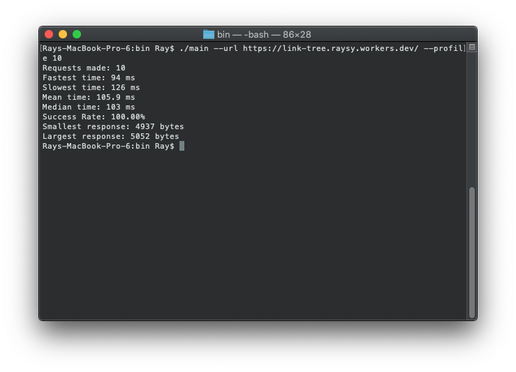
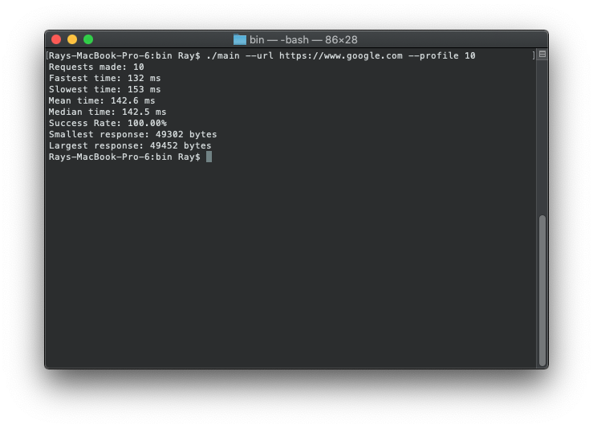

# Systems Assignment

## Local Setup
1. Clone the repository
2. Run `make build`
2. Call the program with `cd bin && ./main`
4. Optionally, run `make clean` to remove any binaries

## Usage
You must pass `--url` which takes a http URL.

```shell script
$ ./main --url https://jsonplaceholder.typicode.com/todos/1
HTTP/1.1 200 OK
Date: Mon, 26 Oct 2020 04:38:18 GMT
Content-Type: application/json; charset=utf-8
Content-Length: 83
Connection: close
Set-Cookie: __cfduid=d668099532e146afeb9794c79e18499be1603687098; expires=Wed, 25-Nov-20 04:38:18 GMT; path=/; domain=.typicode.com; HttpOnly; SameSite=Lax
X-Powered-By: Express
X-Ratelimit-Limit: 1000
X-Ratelimit-Remaining: 999
X-Ratelimit-Reset: 1598841974
Vary: Origin, Accept-Encoding
Access-Control-Allow-Credentials: true
Cache-Control: max-age=43200
Pragma: no-cache
Expires: -1
X-Content-Type-Options: nosniff
Etag: W/"53-hfEnumeNh6YirfjyjaujcOPPT+s"
Via: 1.1 vegur
CF-Cache-Status: HIT
Age: 949
Accept-Ranges: bytes
cf-request-id: 0604cc403d000074310990e000000001
Report-To: {"endpoints":[{"url":"https:\/\/a.nel.cloudflare.com\/report?s=9fz4%2Fk97Q6wHmzC7fUGFyz7CHSFGhPV65GajKOLE8YUsf4WN2Q6GrMnn1nMUMTY5n8FKz0k6i2iaN%2FndNP6xTMvLl4iWhysepG1Er0a7n6yRV1piPTFyxQFNP7df"}],"group":"cf-nel","max_age":604800}
NEL: {"report_to":"cf-nel","max_age":604800}
Server: cloudflare
CF-RAY: 5e817cad2bf07431-IAD

{
  "userId": 1,
  "id": 1,
  "title": "delectus aut autem",
  "completed": false
}
```

If you pass `--profile` (number of requests to make) along with `--url` a benchmark will be run with the specified number for requests.

```shell script
$ ./main --url https://jsonplaceholder.typicode.com/todos/1 --profile 5
Requests made: 5
Fastest time: 59 ms
Slowest time: 74 ms
Mean time: 64.4 ms
Median time: 62 ms
Success Rate: 100.00%
Smallest response: 1154 bytes
Largest response: 1162 bytes
```

Pass `--help` for further information on the flags.

## Results
Running against link-tree

Running against Google


After testing several popular sites against link-tree powered by cloudflare, it is very performant, even beating out google. Each site was tested with 10 requests. Measurements are in milliseconds.

| site      | fastest | slowest | mean  | median |
|-----------|---------|---------|-------|--------|
| link-tree | 99      | 142     | 113   | 108    |
| google    | 122     | 137     | 127.2 | 127    |
| gmail     | 80      | 191     | 104.3 | 85.5   |
| jsonapi   | 63      | 79      | 72.2  | 73     |